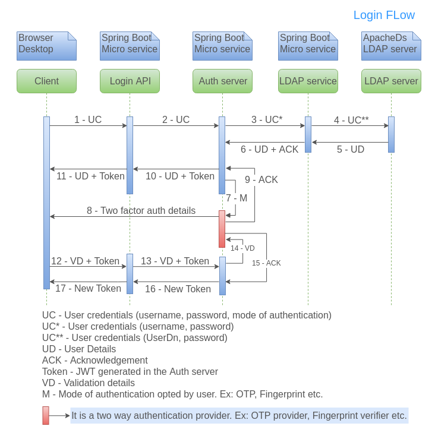
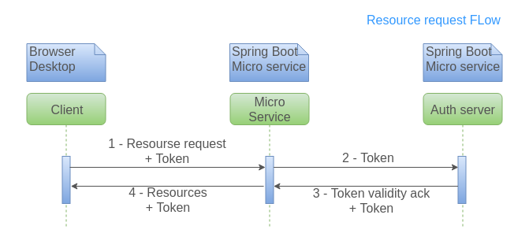
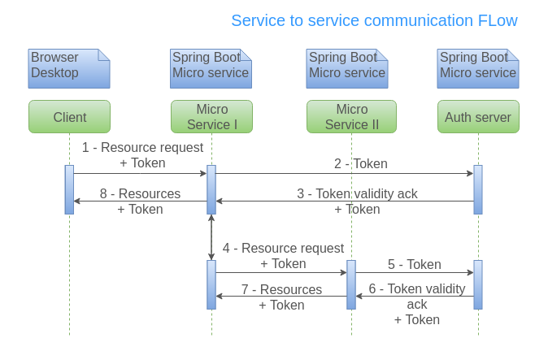

# Auth Implementation

Please find below the sequence diagrams for auth flows.

**Login flow:**

**Resource request flow:**

**Service to Service communication:**

## Documentations for the Auth Implementations

1. [Auth Adapter Documentation](auth-adapter.md)
2. [Auth Angular User Guide](../../contribute/coding-standards/auth-angular-user-guide.md)
3. [Auth SpringBoot User Guide](../../contribute/coding-standards/auth-springboot-user-guide.md)

