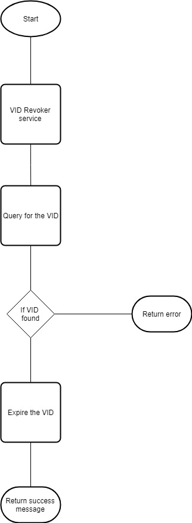
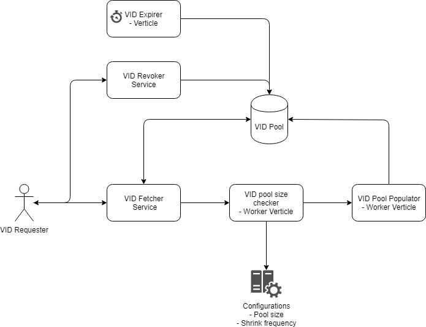

# VID Generator

\# VID Generator

## Background

A virtual ID can be requested by an Indivudual against his UIN. The request is received to fetch a VID, which is unallocated yet at the time of request. There are many types of VIDs such as Perpetual VIDs, Transactional, Long term, short term.

## Solution

**The key solution considerations are**

A pool of the VIDs are maintained for the faster dispatch of the VIDs to the requestor.

* Vert.x REST Services:

   Following are the services which are available for the VID generator component, 

  1. VID Fetcher Service
     * This service requests for an unassigned VIDs. 
     * Expiry days is passed as a parameter to this service. So, the VID pool knows when to expire this VID.
     * In case of perpetual VIDs, the expiry days is not passed. So that, the expiry of the VIDs have to be called back specifically.
     * Each time when this service is called, a call is triggered to the "VID pool size checker"
     * Once the VID assigned, the status is changed to ASSIGNED

**Flowchart diagram for fetcher**

1. VID Revoke Service
   * This service revokes the VID and allocates the VID in the free pool.
   * This service accepts the VID as input.
   * The requested VID status is changed to EXPIRED
   * The expired VID can be reallocated after the configured cool-off period

**Flowchart diagram for revoker**

* Vert.x Verticles:

   Following are the various verticles which are available, 

1. VID pool size checker
   * This vertical checks whether the pool has the available sufficient VIDs. 
   * The configuration for the Shrink pool size, number of VIDs to be generated etc., are retrieved from the config server.
   * If the pool had shrunk below the configured size, the next "VID Pool Populator" vertical is notified.
   * The "VID pool size checker" vertical is called whenever a request is received for the VID generator.
2. VID Pool Populator
   * When the notification is received from the "VID pool size checker", this vertical is notified to generate the next set of VIDs are generated and placed in the pool.
   * When this vertical runs, it creates a lock. So that no multiple populator runs.
   * The worker verticle size is double as "VID Genertor Service".
   * The status of the new generated VIDs is AVAILABLE
   * Vert.x expirer:
     * The expired VIDs status' have to be changed back to available. This scheduler runs at night when the traffic is minimal. The entire database have to be scanned for the expired VIDs.
     * The VID's status is changed back to AVAILABLE, if the VID is expired and crossed the cool-off period. 

**Flowchart diagram for expirer**

* Database:
  1. A separate schema is needed for the VID.
  2. VID Statuses are maintained in the database.

**Module diagram**

