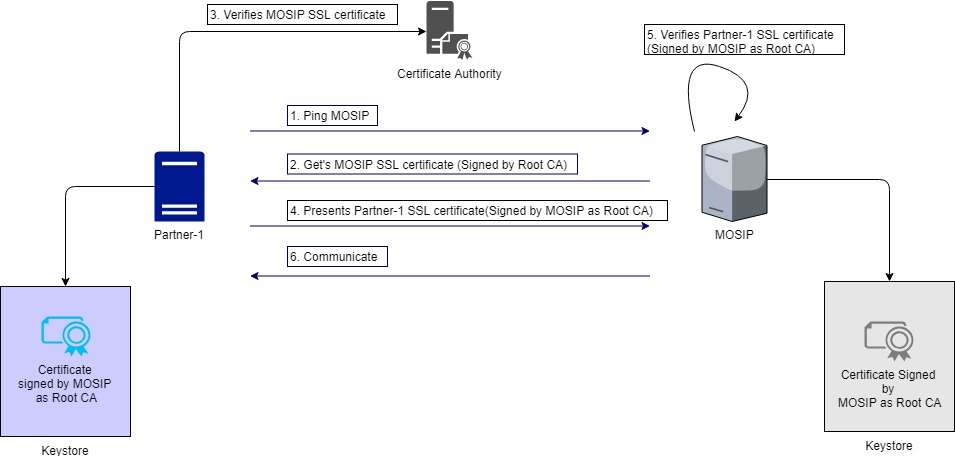

# MOSIP Partner Secure Communication

## Introduction

MOSIP and Partners communicate with each other when indviduals avail services of Partners. The communication must to be executed safely and securely.

* Confidential: The communication should be confidential and no other parties should be able to eaves drop the communicated details.
* Integrity:  The integrity of the communication should be maintained.  

## Security at various levels

### Network Layer

* All communication from Partners to MOSIP is routed via the MISP.
* The communication is protected via the secured network protocol suite of IPSec. 

### Presentation Layer

Process flow for communication at Presentation Layer:

1. Partner pings MOSIP. 
2. Partner gets the MOSIP certificate which is signed by the Root CA.
3. Partner then verifies the MOSIP certificate with the Root CA.
4. Once validated, the Partner shares its SSL certificate to the MOSIP. This SSL certificate is already signed by MOSIP as Root CA. 
5. MOSIP verifies the SSL certificate. 
6. Once both the SSL certificates are validated, the communication channel is established and communication happens. 

### Application Layer - Encryption

1. The data is encrypted in the Application Layer itself before it gets into the Presentation Layer. 
2. The Encryption certificate is shared across by both the parties \(MOSIP & Partners\) to decrypt the content. 

### Application Layer - Digital signature

1. Both the parties \(MOSIP and Partner\) have to sign the request and response in the communication. 
2. Partner signs request and response using Partner's signature certificate.  MOSIP can verify the signature using Partner's public key. 
3. MOSIP signs request and response using MOSIP signature certificate. Partner can verify signature using MOSIP's public key. 

### Certificates used

Altogether, 3 certificates are used in the communication:

1. SSL certificate: Used in the Presentation Layer
2. Encryption certificate: Used in the Application Layer
3. Signature certificate: Used in the Application Layer

