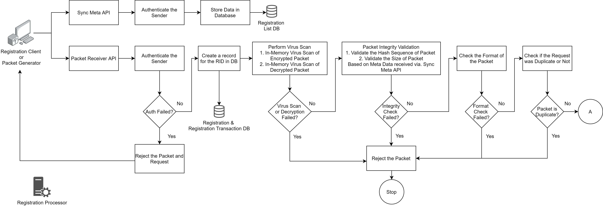
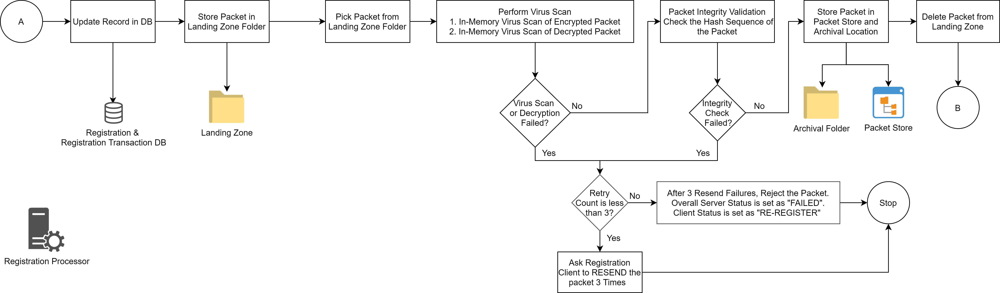
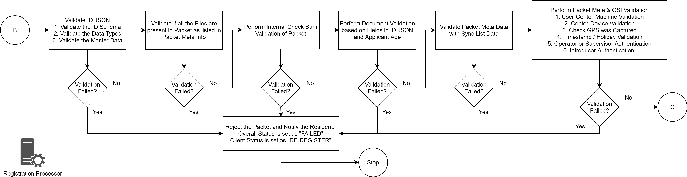
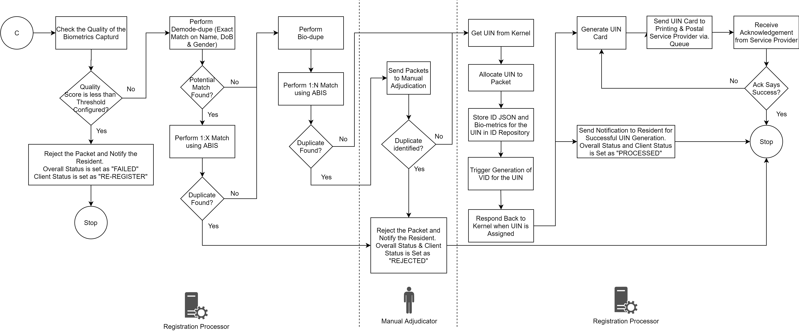
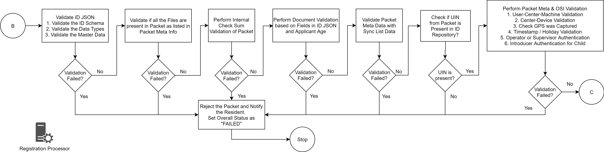
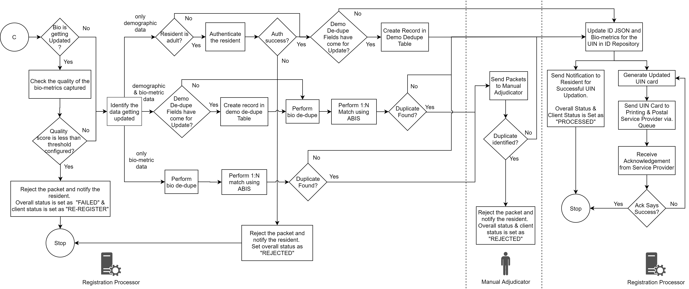
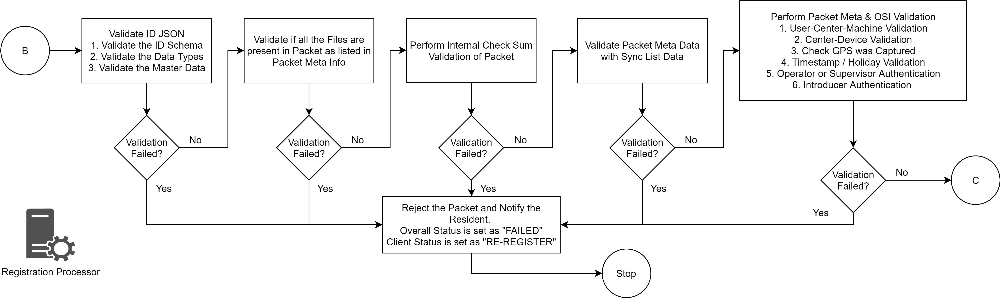
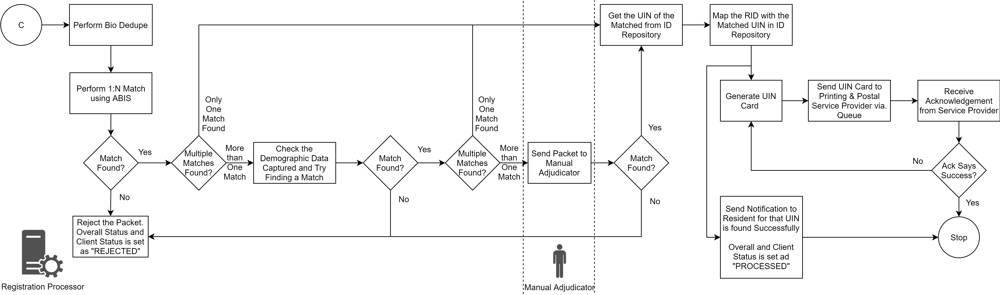
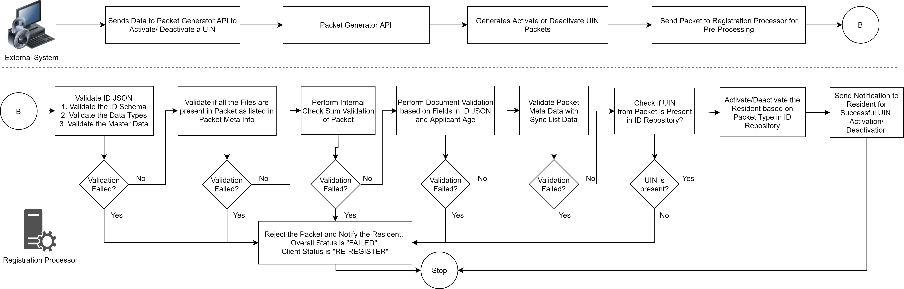
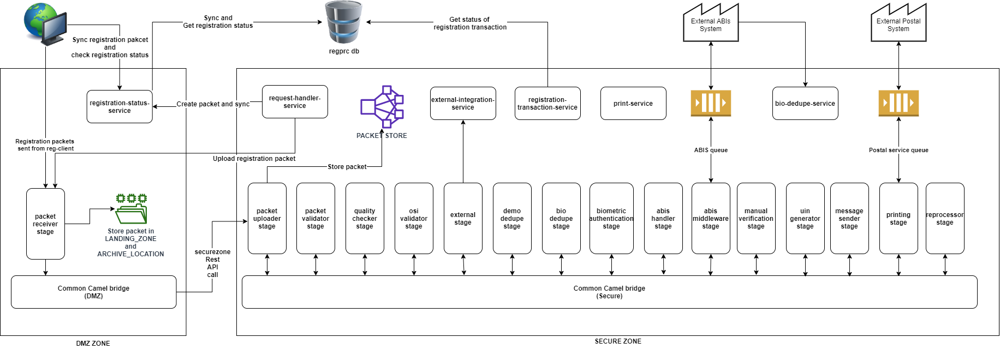

# Registration Processor

## Overview

Registration Processor processes the data \(demographic and biometric\) of an Individual for quality and uniqueness and then issues a Unique Identification Number \(UIN\). It also provides functionality to update demographic and biometric data and issue a new UIN if lost. The source of data are primarily from

* MOSIP Registration Client
* Existing ID system\(s\) of a country

Important considerations are as follows:

* Once the packet is received on the server packets should not be lost.  
* MOSIP defines and implement the basic registration packet processing flow. However, every country will have their own processing requirements  like integration with their existing ID system and fetch data for validation.  Registration processor provides options to add such stages.
* Registration processor has the capability to integrate with multiple ABIS providers.
* Each processing stage is scalable independently based on the load.
* Each stage in the processor is independent of other stages such that logic of a stage can be changed to improve efficiency without affecting the overall flow.

## Detailed functionality

[Registration Processor Functionality](registration-processor-functionality.md)

## Process flow

### Packet Pre-Processing

### New Packet Processing

### Update Packet Processsing

### Lost UIN Packet Processing

### Activate/De-Activate Packet Processing

## Logical View

## Services

For detailed description of Registration Processor Services refer to [registration processor repo](https://github.com/mosip/registration/tree/master/registration-processor).

For high level and low level design refer to [registration processor repo](https://github.com/mosip/registration/tree/master/registration-processor)

## Build and deploy

Refer to build and deploy instructions in [registration processor repo](https://github.com/mosip/registration/tree/master/registration-processor).

## APIs

[Registration Processor APIs](../../apis/registration-processor-apis.md)

