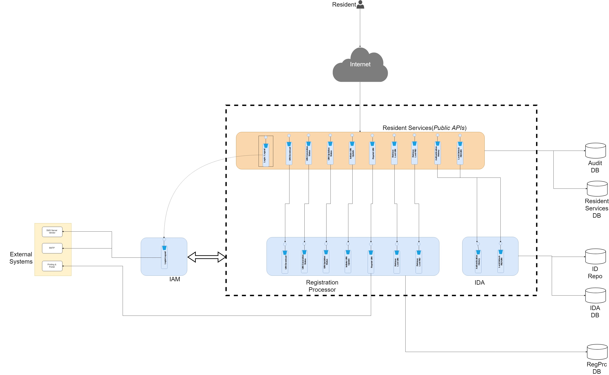

# Resident Services

## Overview

Resident services are the self services which is used by the resident themselves via a portal. Functionalities such as lock/unlock authentication types, reprint UIN, view authentication history etc. are available. The services use OTP method of authentication.

The back-end is a set of services with REST API interface \(provided by MOSIP\) and front end is a portal to be developed by the adopter according to their requirements.

## Detailed functionality

[Resident Services Functionality](resident-services-functionality.md)

## Process flow

* [Lock UIN](https://github.com/nayakrounak/documentation/tree/4f2723f5f3c02a9b74329ac70a3d7bf39914858e/docs/_images/resident_services/resident_services_lock_uin_flow.jpg)
* [Unlock UIN](https://github.com/nayakrounak/documentation/tree/4f2723f5f3c02a9b74329ac70a3d7bf39914858e/docs/_images/resident_services/resident_services_unlock_uin_flow.jpg)
* [Update UIN](https://github.com/nayakrounak/documentation/tree/4f2723f5f3c02a9b74329ac70a3d7bf39914858e/docs/_images/resident_services/resident_services_initiate_uin_update_flow.jpg)
* [Track UIN update](https://github.com/nayakrounak/documentation/tree/4f2723f5f3c02a9b74329ac70a3d7bf39914858e/docs/_images/resident_services/resident_services_track_uin_update_flow.jpg)
* [Track UIN with RID](https://github.com/nayakrounak/documentation/tree/4f2723f5f3c02a9b74329ac70a3d7bf39914858e/docs/_images/resident_services/resident_services_track_uin_with_rid_flow.jpg)
* [Retrieve lost UIN](https://github.com/nayakrounak/documentation/tree/4f2723f5f3c02a9b74329ac70a3d7bf39914858e/docs/_images/resident_services/resident_services_retrieve_lost_uin_flow.jpg)
* [Generate VID](https://github.com/nayakrounak/documentation/tree/4f2723f5f3c02a9b74329ac70a3d7bf39914858e/docs/_images/resident_services/resident_services_generate_vid_flow.jpg)
* [Revoke VID](https://github.com/nayakrounak/documentation/tree/4f2723f5f3c02a9b74329ac70a3d7bf39914858e/docs/_images/resident_services/resident_services_revoke_vid_flow.jpg)
* [Download e-UIN](https://github.com/nayakrounak/documentation/tree/4f2723f5f3c02a9b74329ac70a3d7bf39914858e/docs/_images/resident_services/resident_services_download_euin_flow.jpg)
* [Reprint e-UIN](https://github.com/nayakrounak/documentation/tree/4f2723f5f3c02a9b74329ac70a3d7bf39914858e/docs/_images/resident_services/resident_services_reprint_euin_flow.jpg)
* [Retrieve lost RID](https://github.com/nayakrounak/documentation/tree/4f2723f5f3c02a9b74329ac70a3d7bf39914858e/docs/_images/resident_services/resident_services_retrieve_lost_rid_flow.jpg)

## Logical view

## Services

For detailed description of Resident Services, code and design refer to [resident services repo](https://github.com/mosip/resident-services).

## Build and deploy

Refer to build and deploy instructions in [resident services repo](https://github.com/mosip/resident-services).

## APIs

[Resident Services APIs](../../apis/resident-service-apis.md)

